> This is a step-by-step demonstration version. The GitHub repository can be found here: https://github.com/caltechmsc/dreid-pack

1. Download the pre-compiled binaries, or manually compile the source code: https://github.com/caltechmsc/dreid-pack/releases/tag/v0.1.0
2. Recommended (Optional): Download structure visualization software: https://www.pymol.org/ (A license is required; free for high school students: https://pymol.org/edu/)
3. Download the proteins you wish to process (I have prepared 379 high-resolution crystal structures): https://github.com/caltechmsc/dreid-pack-guide/tree/main/pdbs
4. The simplest CLI run (whole protein): `dpack full input.pdb output.pdb` (See `-h` for others)
5. Visualization software (such as PyMOL) can be used to view the differences between input and output files.

If you would like more information, or if you are a developer looking to integrate this, please see: https://github.com/caltechmsc/dreid-pack

Full README:

# DREID-Pack

**Full-atom protein side-chain packing powered by the DREIDING force field.**

[Overview](#overview) • [Installation](#installation) • [CLI](#cli) • [Library](#library) • [Pipeline & Algorithm](#pipeline--algorithm) • [License](#license)

---

## Overview

DREID-Pack determines the Global Minimum Energy Conformation (GMEC) of protein side chains. The full pipeline:

1. **Structure Preparation** — Parse PDB/mmCIF, rebuild missing heavy atoms (Kabsch SVD alignment), detect disulfide bonds, assign protonation states by pH and pKa, resolve histidine tautomers via H-bond network analysis, add hydrogens, build covalent topology.
2. **Force-Field Parameterization** — Perceive molecular graph (rings, aromaticity, hybridization), assign DREIDING atom types via rule engine, compute partial charges (AMBER/CHARMM lookup for biopolymers, QEq with exact STO integrals for ligands), generate force-field parameters.
3. **Rotamer Sampling** — Dunbrack 2010 backbone-dependent library with cis-Pro detection and optional polar-hydrogen expansion; NERF coordinate generation.
4. **Self-Energy Pruning** — Sidechain vs fixed-scaffold energy + rotamer preference bias; dead conformers discarded by threshold.
5. **Pair-Energy Computation** — Sidechain vs sidechain for every edge in the spatial contact graph.
6. **Dead-End Elimination** — Goldstein + Split DEE, iterated to convergence with single-survivor absorption.
7. **Tree-Decomposition DP** — MCS/min-fill elimination ordering; exact GMEC for treewidth ≤ 5, rank-1 edge decomposition fallback.

The force field is DREIDING (VdW + hydrogen bond), with optional distance-dependent Coulomb electrostatics. VdW supports both Buckingham (exp-6) and Lennard-Jones (12-6) forms.

### Why DREID-Pack

**Physics.** DREIDING is a transferable, all-atom force field — atom types are automatically assigned from chemical-environment graph topology, not a hand-coded residue-specific lookup table. Buckingham exp-6 (default) gives a softer, more physical repulsive wall than LJ 12-6; both forms are available. Explicit D–H···A hydrogen bonding evaluates all-atom polar-hydrogen geometry. Optional distance-dependent Coulomb electrostatics add charge-based discrimination.

**Chemistry.** Missing heavy atoms are rebuilt via SVD-based template alignment before any packing begins. 29 residue types with full protonation state coverage (Hid/Hie/Hip, Ash/Glh, Cys/Cym/Cyx, Lyn/Arn). All titratable residues (Asp, Glu, Lys, Arg, Cys, Tyr) are assigned states by pH and pKa; histidine tautomers are resolved via hydrogen-bond network scoring with salt-bridge priority override (Nδ/Nε near COO⁻ → Hip). Disulfide bonds are detected by Sγ–Sγ distance and relabeled to CYX. Polar-hydrogen torsions (Ser, Thr, Cys, Tyr, Ash, Glh, Lys, Lyn) are explicitly sampled as discrete candidates. cis-Proline is detected by ω angle and dispatches to the dedicated Dunbrack cis-Pro library.

**Generality.** Any molecule — ligands, cofactors, nucleic acids, solvent, ions — is parameterized automatically and participates as a fixed-scaffold atom. Biopolymer charges come from AMBER/CHARMM lookup tables (29 protein residues × 5 terminal positions × 3 schemes, plus nucleic acids and water models); ligand charges are computed dynamically via charge equilibration (QEq) with exact Slater-type orbital integrals, optionally embedded in the electrostatic field of the surrounding protein. Four packing scopes: full protein, ligand pocket, protein–protein interface, or explicit residue list.

**Algorithm.** Self-energy threshold pruning eliminates dead conformers _before_ the O(n²) pair-energy phase. Spatial grid acceleration replaces brute-force all-pairs distance computation. If the pruned interaction graph has treewidth > 5, rank-1 edge decomposition progressively factors weak pair couplings into self-energy until the graph becomes tractable — no bag-size explosion. Connected components are solved in parallel.

**Engineering.** Design philosophy: maximize compile-time computation, then setup-time precomputation, then minimize runtime cost.

- **Rotamer library** (`dunbrack`): the build script precomputes sin/cos of all 740K χ mean angles across the full φ/ψ grid and bakes the entire Dunbrack 2010 database (~28 MB) into `.rodata`. At query time, bilinear interpolation uses circular weighted means on the precomputed sin/cos pairs — the only runtime trig is a single branchless `atan2f` per χ angle.
- **Coordinate builder** (`rotamer`): the build script code-generates a straight-line NERF `build()` function per residue type, with all fixed torsion and bond-angle sin/cos baked as `f32` immediates. Only the runtime-variable χ and polar-H angles call `sincosf` — for Arg (18 atoms, 4χ), 4 of 36 trig evaluations remain at runtime; for simpler residues, zero.
- **Energy kernels** (`dreid-kernel`): stateless, `#[inline(always)]` potential functions. `precompute()` converts physical constants (D₀, R₀, V, φ₀) into optimized parameter tuples at system-setup time, avoiding repeated sqrt/trig/exp in the energy hot loop.
- **QEq integrals** (`cheq`/`sto-ns`): the QEq J-matrix uses exact two-center Coulomb integrals over Slater-type ns orbitals via ellipsoidal coordinate expansion (Rappé & Goddard, 1991) — no Gaussian approximation.
- **Dispatch**: Buckingham vs LJ and Coulomb on/off are resolved at compile time via `const` generics — zero runtime branching in the inner loop.
- **Parallelism**: every compute-intensive phase — sampling, self-energy, pair-energy, DEE convergence, subgraph DP — runs on `rayon`'s work-stealing thread pool.
- **I/O**: PDB and mmCIF, both read and write.

## Installation

**CLI**

```bash
cargo install dreid-pack
```

**Library**

```toml
[dependencies]
dreid-pack = "0.1.0"
```

Set `default-features = false` to exclude the CLI dependencies (`clap`, `anyhow`, `indicatif`, `console`).

## CLI

The binary is called `dpack`. Four subcommands control the packing scope:

```bash
# Pack all residues
dpack full input.pdb output.pdb

# Pack near a ligand pocket (8 Å default)
dpack pocket input.cif -L A:401 -r 10.0

# Pack a protein–protein interface
dpack interface input.pdb -A A,B -B C -c 6.0

# Pack an explicit residue list
dpack list input.pdb --residues A:42,A:55,B:108
```

Output defaults to `<stem>-packed.<ext>` when omitted.

### Common Parameters

**Structure**

| Flag                 | Description                                     | Default     |
| :------------------- | :---------------------------------------------- | :---------- |
| `--ph <PH>`          | Target pH for protonation state assignment      | input as-is |
| `--his <STRATEGY>`   | His tautomer: `network`, `hid`, `hie`, `random` | `network`   |
| `--no-water`         | Remove crystallographic water                   | keep        |
| `--no-ions`          | Remove monoatomic ions                          | keep        |
| `--no-hetero`        | Remove non-ion HETATM residues                  | keep        |
| `--vdw <FORM>`       | VdW potential: `exp` (Buckingham) or `lj`       | `exp`       |
| `--ff-rules <TOML>`  | Custom DREIDING typing rules                    | built-in    |
| `--ff-params <TOML>` | Custom force-field parameters                   | built-in    |

**Charges**

| Flag                         | Description                                        | Default        |
| :--------------------------- | :------------------------------------------------- | :------------- |
| `--protein-charges <SCHEME>` | `amber-ff14sb`, `amber-ff03`, `charmm`             | `amber-ff14sb` |
| `--nucleic-charges <SCHEME>` | `amber`, `charmm`                                  | `amber`        |
| `--water-charges <MODEL>`    | `tip3p`, `tip3p-fb`, `spc`, `spc-e`, `opc3`        | `tip3p`        |
| `--hetero-qeq <METHOD>`      | Ligand charge method: `embedded`, `vacuum`         | `embedded`     |
| `--qeq-shell <Å>`            | Embedded QEq environment shell radius              | `10.0`         |
| `--qeq-charge <e>`           | QEq target net charge (elementary charge units)    | `0.0`          |
| `--qeq-basis <TYPE>`         | QEq basis: `sto` (exact) or `gto` (approx)         | `sto`          |
| `--qeq-lambda <λ>`           | QEq orbital screening scale factor λ               | `0.5`          |
| `--qeq-tol <TOL>`            | SCF convergence tolerance (RMS Δq)                 | `1e-6`         |
| `--qeq-iter <N>`             | Maximum SCF iterations                             | `2000`         |
| `--qeq-damp <STRATEGY>`      | Charge update damping: `none`, `fixed:D`, `auto:D` | `auto:0.4`     |
| `--no-h-scf`                 | Disable hydrogen nonlinear SCF                     | off            |

**Packing**

| Flag                       | Description                           | Default |
| :------------------------- | :------------------------------------ | :------ |
| `-e, --electrostatics <D>` | Enable Coulomb with ε(r) = D·r        | off     |
| `--no-polar-h`             | Skip polar-hydrogen torsion sampling  | sample  |
| `--include-input`          | Add input conformation as candidate   | off     |
| `-T, --template <MOL2>`    | Hetero residue template (repeatable)  | —       |
| `-E, --self-energy <E>`    | Self-energy pruning window (kcal/mol) | `15.0`  |
| `-p, --prob-cutoff <P>`    | Min Dunbrack rotamer probability      | `0.0`   |
| `-q, --quiet`              | Suppress progress output              | off     |

_Run `dpack <subcommand> --help` for the full parameter set._

## Library

The public API exposes three layers: I/O, system model, and packing.

### End-to-End Example

```rust
use dreid_pack::io::{self, Format, ReadConfig};
use dreid_pack::{PackConfig, pack};
use std::io::{BufReader, BufWriter};

// Read and parameterize
let reader = BufReader::new(std::fs::File::open("input.pdb")?);
let mut session = io::read(reader, Format::Pdb, &ReadConfig::default())?;

// Pack with default settings
pack::<()>(&mut session.system, &PackConfig::default());

// Write result
let writer = BufWriter::new(std::fs::File::create("output.pdb")?);
io::write(writer, &session, Format::Pdb)?;
```

`pack::<()>` uses zero-cost no-op progress tracking. Implement the `Progress` trait for custom phase-level callbacks.

Please see the [API documentation](https://docs.rs/dreid-pack) for details.

## Pipeline & Algorithm

```mermaid
flowchart TD
    IN[/"PDB · mmCIF"/]

    subgraph prep ["Structure Preparation — bio-forge"]
        IN --> parse["Parse Structure"]
        parse --> clean["Clean: Strip Water / Ions / Hetero"]
        clean --> repair["Repair: Rebuild Missing Heavy Atoms"]
        repair --> ss["Disulfide Detect"]
        ss --> titrate["pH Titration\n(Asp/Glu/Lys/Arg/Cys/Tyr pKa)"]
        titrate --> salt{"Salt Bridge\nNδ/Nε near COO⁻?"}
        salt -->|yes| hip["→ Hip"]
        salt -->|no| hisn{"His Strategy"}
        hisn -->|HbNetwork| hnet["Score H-bond Network\n(Hid / Hie)"]
        hisn -->|Direct| hdir["Force Hid / Hie"]
        hisn -->|Random| hrand["Random Hid / Hie"]
        hip --> addh["Add Hydrogens"]
        hnet --> addh
        hdir --> addh
        hrand --> addh
        addh --> topo["Topology:\nIntra-residue Bonds\n+ Peptide/Nucleic Backbone\n+ Hetero Templates\n+ Disulfide Bonds"]
    end

    subgraph forge ["Force Field Parameterization — dreid-forge"]
        topo --> perc["Perception:\nRings\n→ Kekulé\n→ Aromaticity\n→ Resonance\n→ Hybridization"]
        perc --> atyp["DREIDING Typing"]
        atyp --> cdisp{"Charge Method"}
        cdisp -->|Protein / Nucleic| ffc["ffcharge Lookup\n(AMBER / CHARMM)"]
        cdisp -->|Ligand / Hetero| qeq["QEq: STO Integrals\n→ J Matrix → Linear Solve"]
        ffc --> pgen["Parameter Generation & Precomputation"]
        qeq --> pgen
    end

    subgraph build ["System Build — dreid-pack io"]
        pgen --> scope["Scope Filter\n(Full / Pocket / Interface / List)"]
        scope --> part["Partition Mobile / Fixed"]
        part --> dihed["Compute Backbone φ, ψ, ω"]
    end

    dihed --> dunq & reach & fatoms

    subgraph par ["Parallel Initialization"]
        direction LR

        subgraph s1 ["Rotamer Sampling"]
            direction TB
            dunq["Dunbrack 2010 Query\n(bilinear φ,ψ interpolation)"]
            dunq --> cis{"cis-Pro?\n(|ω| < π/2)"}
            cis -->|yes| cislib["cis-Pro Library"]
            cis -->|no| translib["trans Library"]
            cislib --> probf["Probability Filter\n(keep best + p ≥ cutoff)"]
            translib --> probf
            probf --> ph["Polar-H Expand\n(Ser/Thr/Cys/Tyr/Ash/Glh/Lys/Lyn)"]
            ph --> nerf["NERF Coordinate Build\n(code-generated per residue type)"]
            nerf --> bias["Rotamer Bias\nw · min(−ln p/p_max, 5)"]
        end

        subgraph s2 ["Contact Graph"]
            direction TB
            reach["Cα + Sidechain Reach"]
            reach --> grid1["Spatial Grid"]
            grid1 --> edet["Edge Detect\n(Cα dist ≤ reach_i + reach_j + cutoff)"]
            edet --> csr["CSR Adjacency"]
        end

        subgraph s3 ["Fixed Scaffold"]
            direction TB
            fatoms["Fixed Atom Pool"]
            fatoms --> grid2["Spatial Grid\n(cell size = interaction cutoff)"]
        end
    end

    bias --> selfe
    grid2 --> selfe

    selfe["Self-Energy: SC vs Scaffold"]
    selfe --> vdw1["VdW + H-bond + Coulomb\n(per-candidate, parallel)"]
    vdw1 --> addb["+ Weighted Rotamer Bias"]
    addb --> thresh["Threshold Prune\n(e_min + 15 kcal/mol)"]
    thresh --> compact["Compact Conformations"]

    compact --> paire
    csr --> paire

    paire["Pair Energy: SC vs SC"]
    paire --> vdw2["VdW + H-bond + Coulomb\n(per-edge × per-pair, parallel)"]

    vdw2 --> gold["Goldstein DEE\n(parallel per-slot, converge)"]
    gold --> abs1["Absorb Singletons\n(fold pair-E into self-E)"]
    abs1 --> spl["Split DEE\n(per-split-neighbor, converge)"]
    spl --> abs2["Absorb Singletons"]
    abs2 -.->|×2| gold

    abs2 --> filt["Filter Weak Edges\n(|pair_e| ≤ 2.0 kcal/mol)"]
    filt --> cc["Connected Components"]
    cc -->|parallel| mcs["MCS Elimination Ordering"]
    mcs --> chk{"Chordal\n(PEO)?"}
    chk -->|yes| peo["PEO Bags"]
    chk -->|no| minf["Min-fill Heuristic Bags"]
    peo --> tw{"tw ≤ 5?"}
    minf --> tw
    tw -->|yes| msg["Bottom-up Message Passing\n→ Traceback"]
    tw -->|no| edec["Rank-1 Edge Decomposition\n(fold weak pairs into self-E)"]
    edec -.->|retry| mcs
    msg --> gmec(["GMEC"])

    gmec --> wb["Write-back Coordinates"]
    wb --> recon["Reconstruct Structure"]
    recon --> OUT[/"PDB · mmCIF"/]
```



### Dependencies

**Direct**

| Crate                                                   | Role                                                                            |
| :------------------------------------------------------ | :------------------------------------------------------------------------------ |
| [`dreid-forge`](https://crates.io/crates/dreid-forge)   | Orchestrates structure preparation, DREIDING atom typing, and charge assignment |
| [`dreid-kernel`](https://crates.io/crates/dreid-kernel) | Stateless `no_std` energy kernels with `precompute()` optimization              |
| [`dunbrack`](https://crates.io/crates/dunbrack)         | Compile-time-embedded Dunbrack 2010 rotamer library (740K entries)              |
| [`rotamer`](https://crates.io/crates/rotamer)           | Code-generated straight-line NERF coordinate builder                            |
| [`rayon`](https://crates.io/crates/rayon)               | Work-stealing thread pool for data parallelism                                  |

**Transitive (via `dreid-forge`)**

| Crate                                                 | Role                                                                                                                                |
| :---------------------------------------------------- | :---------------------------------------------------------------------------------------------------------------------------------- |
| [`bio-forge`](https://crates.io/crates/bio-forge)     | PDB/mmCIF parsing, cleaning, heavy-atom repair (Kabsch SVD), pH-aware protonation, His tautomer network analysis, topology building |
| [`dreid-typer`](https://crates.io/crates/dreid-typer) | Molecular graph perception (SSSR rings, Kekulé, aromaticity, resonance, hybridization) and DREIDING atom typing rule engine         |
| [`cheq`](https://crates.io/crates/cheq)               | Charge Equilibration (QEq) solver with exact STO integrals, embedded-field support for ligands in protein environments              |
| [`ffcharge`](https://crates.io/crates/ffcharge)       | Compile-time `no_std` AMBER/CHARMM partial charge lookup (protein, nucleic acid, water, ion)                                        |
| [`sto-ns`](https://crates.io/crates/sto-ns)           | Exact two-center Coulomb integrals over ns Slater-Type Orbitals via ellipsoidal expansion                                           |

All non-`rayon` crates are authored and maintained within this project ecosystem.

---

_Caltech Materials and Process Simulation Center (MSC)_

Made by [Tony Kan](https://github.com/TKanX)
